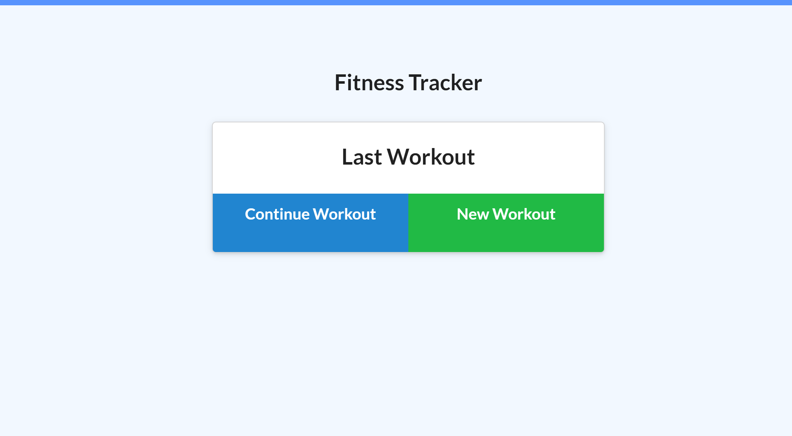
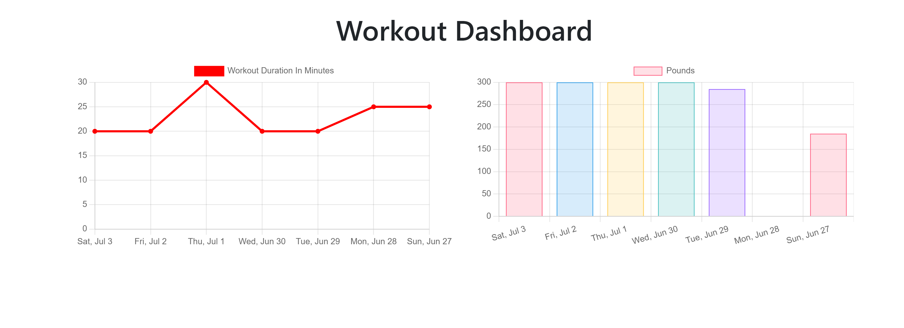

# workout-tracker

# Links:
## Heroku link: https://mysterious-dawn-39842.herokuapp.com/
https://github.com/Gopika2514/workout-traker


For this assignment, you'll create a workout tracker. You have already been provided with the front end code in the `Develop` folder. This assignment will require you to create Mongo database with a Mongoose schema and handle routes with Express.

## User Story

* As a user, I want to be able to view create and track daily workouts. I want to be able to log multiple exercises in a workout on a given day. I should also be able to track the name, type, weight, sets, reps, and duration of exercise. If the exercise is a cardio exercise, I should be able to track my distance traveled.

## Business Context

A consumer will reach their fitness goals more quickly when they track their workout progress.

## Acceptance Criteria

When the user loads the page, they should be given the option to create a new workout or continue with their last workout.

The user should be able to:

  * Add exercises to the most recent workout plan.

  * Add new exercises to a new workout plan.

  * View the combined weight of multiple exercises from the past seven workouts on the `stats` page.

  * View the total duration of each workout from the past seven workouts on the `stats` page.

> **Important:** Look into using a MongoDB aggregate function to dynamically add up and return the total duration for each workout. Check out the [MongoDB documentation on the $addFields](https://docs.mongodb.com/manual/reference/operator/aggregation/addFields/), the [MongoDB documentation on the $sum operator](https://docs.mongodb.com/manual/reference/operator/aggregation/sum/), and the [Mongoose documentation on aggregate functions](https://mongoosejs.com/docs/api.html#aggregate_Aggregate) to learn how it can be accomplished.

To deploy an application with a MongoDB database to Heroku, you'll need to set up a MongoDB Atlas account and connect a database from there to your application. Be sure to use the following guides for support:

  * [Set Up MongoDB Atlas](../04-Important/MongoAtlas-Setup.md)

  * [Deploy with Heroku and MongoDB Atlas](../04-Important/MongoAtlas-Deploy.md)

## Mock-Up

The following screenshots demonstrates the application functionality results:






### Update Application Code for MongoDB Connection

Next and last, you'll update the application's code to accommodate the MongoDB connection.

1. In VS Code, navigate to your application and locate where you connect to your database. Once you find it, update it so it looks like the following code:

   ```js
   mongoose.connect(
     process.env.MONGODB_URI || 'mongodb://localhost/deep-thoughts',
     {
       useNewUrlParser: true,
       useUnifiedTopology: true,
       useCreateIndex: true,
       useFindAndModify: false
     }
   );
   ```

2. With this code in place, the `mongoose.connect()` command will attempt to use the environment variable first. If it's running on Heroku, it will find that variable and use it. If it's running locally on your machine, it won't find that variable and will fall back to use your local database connection instead.

3. Save your code and use the following Git commands to add, commit, and push it to Heroku:

   ```bash
   git add -A
   git commit -m 'deploying'
   # make sure you're pushing from your local main branch!
   git push heroku main
   ```


